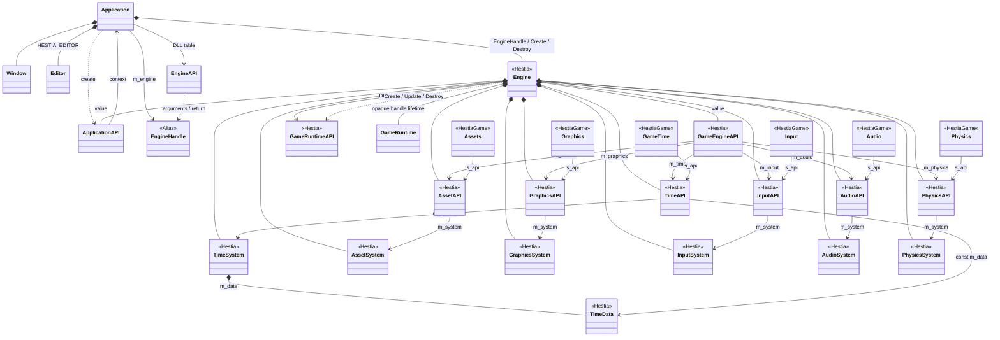
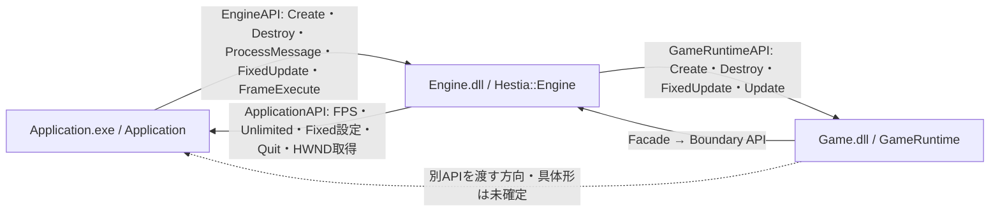
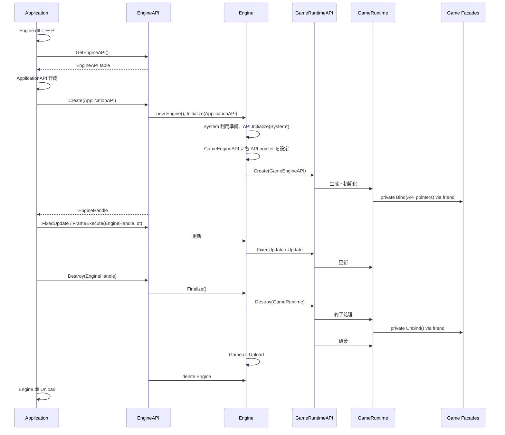
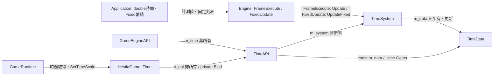
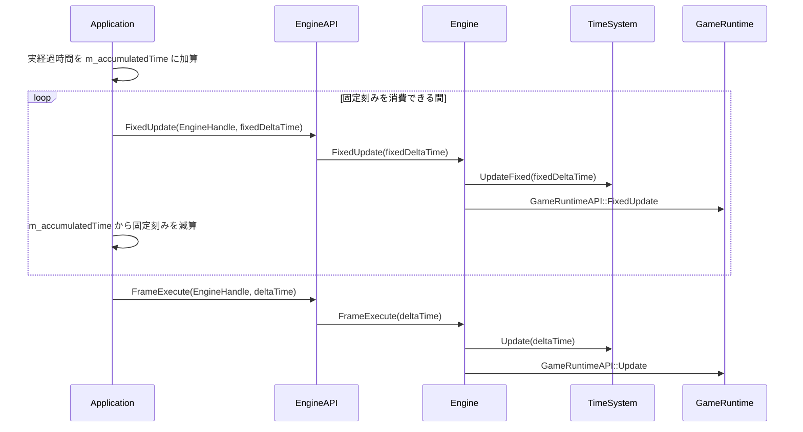

# クラス間の関係
---
ClassDesign の指針・Class 配下の宣言とは別に、所有・参照・呼び出しの関係を示す。
図は更新ノートと確認済みの決定を反映する。各 System の内部状態・具体的な機能 API は未確定。

## 所有と非所有参照
---
`*--` は所有・寿命管理、`-->` は非所有参照、`..>` は API を通じた呼び出しを表す。GameRuntime の実メモリは Game.dll 内で生成・破棄する。

[Application](./Class/Application.md)  
[Engine](./Class/Engine.md)  
[AssetSystem／API／Facade](./Class/AssetSystem.md)  
[その他 System／API／Facade](./Class/Subsystems.md)  
[Time](./Class/Time.md)  
[EngineHandle](./Class/Engine.md#enginehandle)

Engine が Boundary API を所有し、API は Initialize(XxxSystem*) で非所有ポインタを受け取る。Application が持つ EngineHandle は void* の alias であり、Engine の型定義を共有 Header に公開しない。Facade は Game.dll 内の static ポインタを設定して利用する。GameTime は HestiaGame::Time を表す。

**未確定（U08）**：Editor の実装先 DLL と Engine／Game の情報経路はノートにない。

**提案**：この図では Application の所有だけを示す。情報経路は編集する対象が決まってから追加する。

## DLL 越しの操作方向
---

[ApplicationAPI](./Class/Application.md#applicationapi)  
[EngineAPI](./Class/Engine.md#engineapi)  
[GameRuntimeAPI](./Class/Engine.md#gameruntimeapi)  
[SubsystemApiFacadeDesign](./SubsystemApiFacadeDesign.md)

EngineAPI::Create は Engine の Initialize、Destroy は Finalize までを含む。Initialize／Finalize の独立した API テーブル項目は今回の決定 U02 により置かない。

## 生成・終了の通常経路
---

[GameRuntime](./Class/GameRuntime.md)  
[Engine](./Class/Engine.md)

各 EngineAPI の入口で EngineHandle を Engine* に戻して内部処理を呼ぶ。Engine 内部の Initialize／Finalize は残し、Create／Destroy がそれらをまとめて呼ぶ。

## Time の接続
---
更新ノートの所有・参照と、通常の更新を FrameExecute に置く決定を示す。

[Time](./Class/Time.md)  
[OpenQuestions U03](./OpenQuestions.md#u03time-とフレーム順序)

TotalTime は TimeSystem::Update でのみ加算する。通常の時間更新は FrameExecute 内で GameRuntime::Update より前に行う。FixedUpdate の回数は Application が蓄積時間を消化して決める。

## 固定更新とフレーム更新
---

図では固定更新の消化 → FrameExecute の通常経路を示す。TimeSystem::Update の位置は FrameExecute 内とし、各 System の詳細な前後関係はまだ決めない。

**決定（U03）**：固定時間更新は TimeScale によって増減する。

**未確定**：Game から Application へ渡す API の具体形は未確定。

**提案**：各 System の用途と Game から必要な Application 操作を整理する段階で、対応する経路を確定する。
