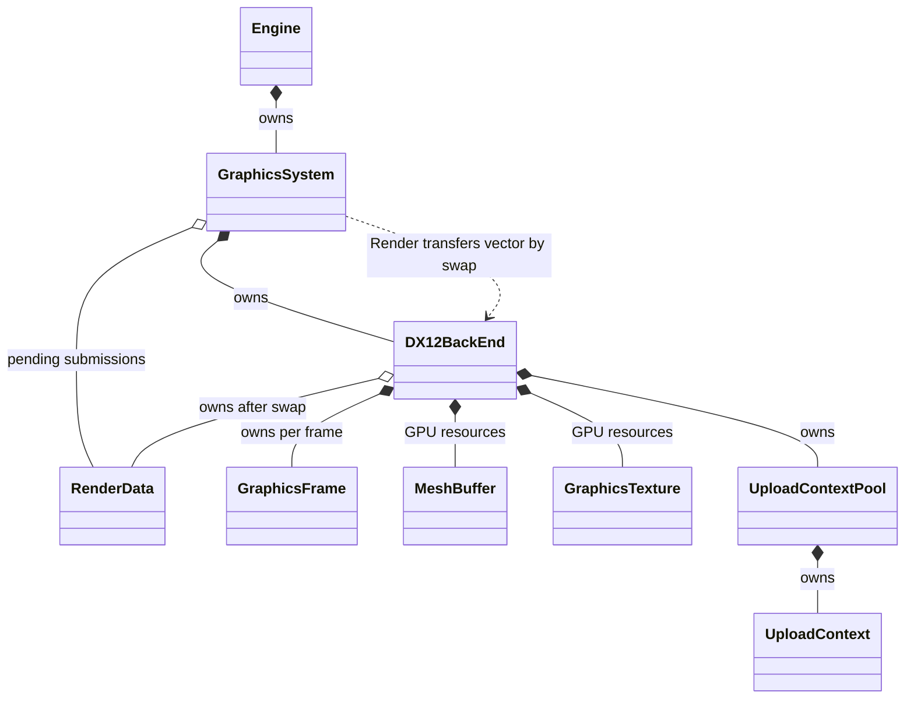
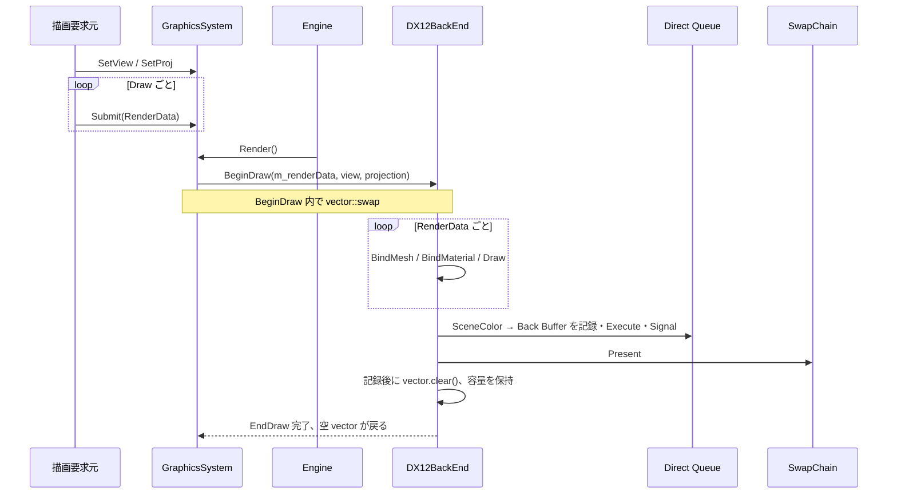

# Graphics System
---
テクスチャ付きの静的な3D対象を Depth 付き SceneColor に描き、Back Buffer へ表示する Graphics 基盤。GraphicsSystem は描画要求と View／Projection を受け付け、DX12BackEnd が GPU 資源と描画処理を担う。

## 基本方針
---
GraphicsSystem は Engine が所有する。外部から使う static API は System のインスタンスへ要求を渡し、Engine は各フレームで非 static の Render を呼ぶ。
GraphicsSystem が保持する RenderData は Render の開始時に DX12BackEnd へ vector ごと渡す。Backend は vector を swap して要素をコピー／ムーブせずに所有を移し、コマンド記録が終わった後に要素を消して vector の容量を再利用する。

DX12BackEnd は単一 Direct Queue、SwapChain、描画用 Frame、SceneColor 二枚、Depth、Master／Visible SRV、Upload Context、Mesh／Texture の GPU 実体を所有する。描画要求に含まれる MeshKey／TextureKey は Backend が保持する資源を引くための暫定キーである。

## GraphicsSystem
---
**役割**

View／Projection と Draw ごとの RenderData を受け付け、Engine から呼ばれる Render で描画要求を DX12BackEnd に渡す。GPU実体や CommandList を Game 向けに公開しない。

```cpp
namespace Hestia
{
    using Matrix4x4 = std::array<float, 16>;

    struct RenderData;
    class DX12BackEnd;

    class GraphicsSystem
    {
    public:
        GraphicsSystem();
        ~GraphicsSystem();

        bool Initialize(HWND window);
        void Render();
        void Finalize();

        static void SetView(const Matrix4x4& view);
        static void SetProj(const Matrix4x4& projection);
        static void Submit(RenderData data);

    private:
        static GraphicsSystem* s_instance;

        Matrix4x4 m_view;
        Matrix4x4 m_projection;
        std::vector<RenderData> m_renderData;
        std::unique_ptr<DX12BackEnd> m_backEnd;
    };
}
```

- [RenderData](#renderdata)
- [DX12BackEnd](#dx12backend)
[Engine](./Engine.md#engine)

**所有・参照**：Engine が GraphicsSystem を値所有し、GraphicsSystem が unique_ptr で DX12BackEnd を所有する。s_instance は static API が稼働中の System を参照するための private な非所有ポインタ。Initialize で関連付け、Finalize で解除する。

**API とメンバ**：constructor は初期 View を Identity、Projection を固定値にする。具体的な Projection 行列は未確定。SetView／SetProj は次の Render が使う行列を更新する。Submit は一件の RenderData を System の vector に追加する。Render は行列と vector を Backend に渡して一回の描画を実行する。Finalize は Backend の GPU 作業完了後に終了し、static 参照を解除する。

**Engine との接続**：Engine::Initialize が GraphicsSystem::Initialize(HWND) を呼び、Engine::FrameExecute が GraphicsSystem::Render を呼ぶ。終了時は Engine::Finalize から GraphicsSystem::Finalize を呼ぶ。FrameExecute は GraphicsSystem の API に置かない。

**提出データの所有移動**：Render の開始時に DX12BackEnd::BeginDraw が受け取った vector と Backend の空 vector を swap する。System 側には Backend が前回使い終えた vector が戻るため、その容量を次の Submit に再利用できる。RenderData の各要素を Backend 用に複製する処理は設けない。

### RenderData
---
**役割**

一回の Draw に必要な Mesh／Material Texture／World／Material 定数をまとめる。

```cpp
namespace Hestia
{
    struct MeshKey
    {
        uint32_t m_value = 0;
    };

    struct TextureKey
    {
        uint32_t m_value = 0;
    };

    struct PerMaterialConstants
    {
        std::array<float, 4> m_diffuseColor{};
        std::array<float, 4> m_specularColor{};
        std::array<float, 4> m_emissionColor{};
        float m_roughness = 0.5f;
        float m_metallic = 0.0f;
        std::array<float, 2> m_padding{};
    };

    struct PerFrameConstants
    {
        Matrix4x4 m_view;
        Matrix4x4 m_projection;
    };

    struct PerObjectConstants
    {
        Matrix4x4 m_world;
    };

    struct GraphicsVertex
    {
        std::array<float, 3> m_position;
        std::array<float, 2> m_uv;
        std::array<float, 3> m_normal;
        std::array<float, 3> m_tangent;
        std::array<float, 4> m_color;
    };

    struct RenderData
    {
        MeshKey m_mesh;
        std::array<TextureKey, 16> m_materialTextures{};
        Matrix4x4 m_world{};
        PerMaterialConstants m_material;
    };
}
```

- [GraphicsSystem](#graphicssystem)
- [DX12BackEnd](#dx12backend)

**所有・参照**：RenderData は提出から Render の記録完了まで GraphicsSystem または DX12BackEnd のどちらか一方が所有する。MeshKey／TextureKey は Backend が保持する GPU 資源を指す暫定値であり、GPU資源そのものを所有しない。

**API とメンバ**：World は呼び出し側が作成して渡す。Material 定数と Material Texture は Draw 単位で渡す。SetMaterial／BindMaterial の最終的な呼び分けは設計しない。現在は RenderData を Submit する形を仮の入口とする。

**不足**：MeshKey／TextureKey を割り当てて資源を登録する API はまだない。AssetSystem との接続や共有 Handle の型も未確定である。

**提案**：まず RenderData が参照する Mesh／Texture の登録元と寿命を決め、その後に Submit の呼び出し側を定める。

### DX12BackEnd
---
**役割**

DirectX 12 の描画・転送実体を所有し、RenderData を GPU の Draw 呼び出しへ変換する。System から受け取る RenderData は Render 中に固定される前提で処理する。

```cpp
namespace Hestia
{
    class DX12BackEnd
    {
    public:
        bool Initialize(HWND window);
        void BeginDraw(
            std::vector<RenderData>& renderData,
            const Matrix4x4& view,
            const Matrix4x4& projection);
        void EndDraw();
        void Finalize();

    private:
        void BindMesh(const MeshKey& mesh);
        void BindMaterial(
            const PerMaterialConstants& material,
            const std::array<TextureKey, 16>& textures);
        void RecordDraw(const RenderData& renderData);
        void CopySceneToBackBuffer();

        std::vector<RenderData> m_renderData;

        // Device、Direct Queue、SwapChain、Frame、Heap、SceneColor、
        // Depth、Upload Context、Mesh／Texture の GPU 実体を保持する。
    };
}
```

BeginDraw の所有移動は vector の swap で行う。

```cpp
void DX12BackEnd::BeginDraw(
    std::vector<RenderData>& renderData,
    const Matrix4x4& view,
    const Matrix4x4& projection)
{
    m_renderData.swap(renderData);

    // View／ProjectionとFrameの描画記録を開始する
}
```

- [GraphicsSystem](#graphicssystem)
- [GraphicsFrame](#graphicsframe)
- [MeshBuffer](#meshbuffer)
- [GraphicsTexture](#graphicstexture)
- [UploadContextPool](#uploadcontextpool)

**所有・参照**：GraphicsSystem が Backend を unique_ptr で所有する。Backend は GPU 実体、描画に必要な Frame／定数 Buffer／Heap、および RenderData の vector を所有する。BeginDraw の引数は呼び出し中に参照し、vector の swap 後は Backend の member がデータを所有する。

**API とメンバ**：BeginDraw は vector を m_renderData と swap し、View／Projection と Frame の描画記録を開始する。EndDraw は全 RenderData を順に BindMesh／BindMaterial して描画し、SceneColor の結果を Back Buffer へ渡して Present する。コマンド記録後に m_renderData.clear() を呼び、要素の CPU データを解放しつつ vector 容量を残す。GPUが参照する Mesh／Texture／定数 Buffer は Fence 完了まで Backend の資源として保持する。

### GraphicsFrame
---
**役割**

フレーム別の描画記録、PerFrame CB、Visible SRV Heap を保持する。

```cpp
namespace Hestia
{
    struct GraphicsFrame
    {
        ComPtr<ID3D12CommandAllocator> m_commandAllocator;
        ComPtr<ID3D12GraphicsCommandList> m_commandList;
        ComPtr<ID3D12Resource> m_perFrameCB;
        ComPtr<ID3D12DescriptorHeap> m_visibleSRVHeap;
        uint32_t m_visibleSRVCount = 0;
    };
}
```

[DX12BackEnd](#dx12backend)

**所有・参照**：DX12BackEnd がフレーム数分を値所有する。GraphicsFrame は CommandAllocator／CommandList／PerFrame CB／Visible SRV Heap と、Heap内の次のdescriptor位置を示す m_visibleSRVCount を持つ。PerObject／PerMaterial CB と Frame ごとの Fence 値は DX12BackEnd 側で管理し、Frame index ごとに Buffer 領域を分ける。Fence 完了後に該当領域を再利用する。

**API とメンバ**：Frame の再利用時は Fence 完了後に Allocator／List を Reset し、m_visibleSRVCount を0へ戻す。PerObject／PerMaterial CB の位置には RenderData を処理する loop index を使い、objectCount は保持しない。

### MeshBuffer
---
**役割**

Default Heap の Vertex／Index Buffer と、描画時に使う View 情報を保持する。

```cpp
namespace Hestia
{
    struct MeshBuffer
    {
        GpuBuffer m_vertexBuffer;
        GpuBuffer m_indexBuffer;
        uint32_t m_indexCount = 0;
    };

}
```

- [DX12BackEnd](#dx12backend)
- [UploadContextPool](#uploadcontextpool)

**所有・参照**：DX12BackEnd がキーから引ける GPU 資源として保持する。Mesh／Texture の登録、差し替え、破棄 API と資源表の構造は未確定。

### GraphicsTexture
---
**役割**

Texture の GPU 実体と Master SRV の位置を保持する。

```cpp
namespace Hestia
{
    struct GraphicsTexture
    {
        GpuTexture m_resource;
        uint32_t m_masterSRVIndex = 0;
    };
}
```

[DX12BackEnd](#dx12backend)

**所有・参照**：DX12BackEnd が保持する。TextureKey はこの GPU資源を引く暫定値であり、Asset 側の画像データや寿命を定義しない。

### UploadContextPool
---
**役割**

同じ Direct Queue に送る転送の CommandAllocator／CommandList と、Fence 完了まで必要な Upload Buffer を保持し、完了後に記録領域を再利用する。

```cpp
namespace Hestia
{
    struct UploadContext
    {
        CommandAllocator m_commandAllocator;
        CommandList m_commandList;
        std::vector<UploadBuffer> m_uploadBuffers;
        uint64_t m_fenceValue = 0;
    };

    class UploadContextPool
    {
    public:
        UploadContext& Acquire(uint64_t completedFenceValue);
        void CollectCompleted(uint64_t completedFenceValue);
        void Finalize();

    private:
        std::vector<UploadContext> m_contexts;
    };
}
```

[DX12BackEnd](#dx12backend)

**所有・参照**：DX12BackEnd が Pool を所有し、Pool が Context を所有する。Upload Buffer は Context が所有し、転送 Fence の完了後に回収する。

**API とメンバ**：Acquire は再利用可能な Context を返す。未完了 Context は再利用せず、必要になった時点で追加する。転送と描画は同じ Direct Queue に送るため、Queue の送信順で Upload 後の Draw を実行できる。

### GraphicsAPI
---
**役割**

GraphicsSystem の static API と Game.dll の間をつなぐ Boundary API の候補。GraphicsSystem の SetView／SetProj／Submit をどの形で GameRuntime へ公開するかは未確定で、描画関数はまだ宣言しない。

```cpp
namespace Hestia
{
    class GraphicsAPI
    {
    public:
        void Initialize(GraphicsSystem* system);

    private:
        GraphicsSystem* m_system = nullptr;
    };
}
```

- [GraphicsSystem](#graphicssystem)
- [Engine](./Engine.md#engine)
- [GameEngineAPI](./Engine.md#gameengineapi)

**所有・参照**：Engine が値所有し、GraphicsSystem への非所有参照を保持する。GameEngineAPI が GraphicsAPI* を束ねる既存の境界案は、static API の呼び出し元を決めた後に見直す。

**未確定**：GraphicsAPI の描画関数と HestiaGame::Graphics Facade を設けるかは未確定。

**提案**：GraphicsSystem の static API で必要な描画要求を確認してから、DLL 境界に必要な関数だけを決める。

### Graphics
---
**役割**

HestiaGame 側で GraphicsAPI を呼び出す Facade の候補。GraphicsAPI と同様に、公開する描画関数はまだ決めない。

```cpp
class GameRuntime;

namespace HestiaGame
{
    class Graphics
    {
    private:
        static void Bind(Hestia::GraphicsAPI* api);
        static void Unbind();
        inline static Hestia::GraphicsAPI* s_api = nullptr;

        friend class ::GameRuntime;
    };
}
```

[GraphicsAPI](#graphicsapi)  
[GameRuntime](./GameRuntime.md#gameruntime)

**所有・参照**：s_api は GraphicsAPI への非所有参照。GameRuntime から接続・解除する案を残す。

**未確定**：Facade 自体を置くか、GraphicsSystem の static API へ直接つなぐかは未確定。

**提案**：GameRuntime と DLL 境界の描画要求経路を決める段階で採否を確定する。

## 描画契約
---
Root Signature は以下の割り当てで固定する。

| 用途 | 割り当て |
| --- | --- |
| PerFrame／PerObject／PerMaterial | `b0`／`b1`／`b2`、space 0 |
| System Texture | `t0～t15`、space 0 |
| Material Texture | `t0～t15`、space 1 |
| Sampler | Wrap／Clamp × Linear／Point の四種類 |

SceneColor は二枚、Depth は一つ。Master SRV Heap は System 共通、Visible SRV Heap は Frame ごとに持つ。使用する16枠を Master から Visible の連続範囲へコピーし、未使用枠は Null SRV とする。Visible の範囲は対応 Frame の Fence 完了後に再利用する。

PerFrame CB は Frame ごとに持つ。PerObject／PerMaterial CB は DX12BackEnd がそれぞれ一つずつ持ち、Frame index ごとの領域へ追記する。Draw index は RenderData の loop index とし、オブジェクト数を別カウンタに重複保持しない。Visible SRV Heap は m_visibleSRVCount を次の空き位置として表を追記する。転送には Vertex／Index Buffer と Texture を含め、Upload Context と Upload Buffer は Fence 完了後に再利用・回収する。

初期 Shader はコンパイル済み VS／PS 一組、PSO 一つ、固定 InputLayout とする。具体的な照明・後処理 Shader、汎用 Material はこの資料で決めない。

## Render の関係
---


## 描画経路
---


## 未確定事項
---
**未確定**：Submit／SetView／SetProj を呼ぶ側の境界、Mesh／Texture の登録 API と Key の型、Material 値を渡す最終的な API、描画要求を複数 vector で PingPong するかは未確定。Resize・Present 同期・Heap／Buffer 容量の具体値も未確定。

**提案**：今回のモックでは System 内部の入口を static API とし、呼び出し側の DLL 境界は別途決める。まず一つの vector で描画を通し、登録 API と寿命を決める段階で必要なら PingPong を検討する。
