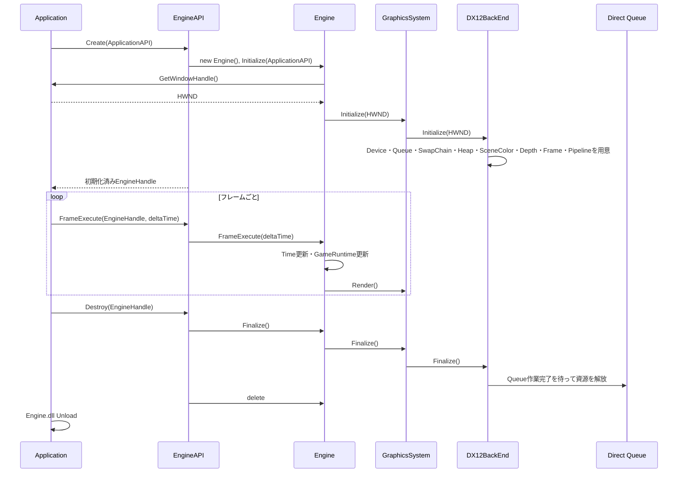
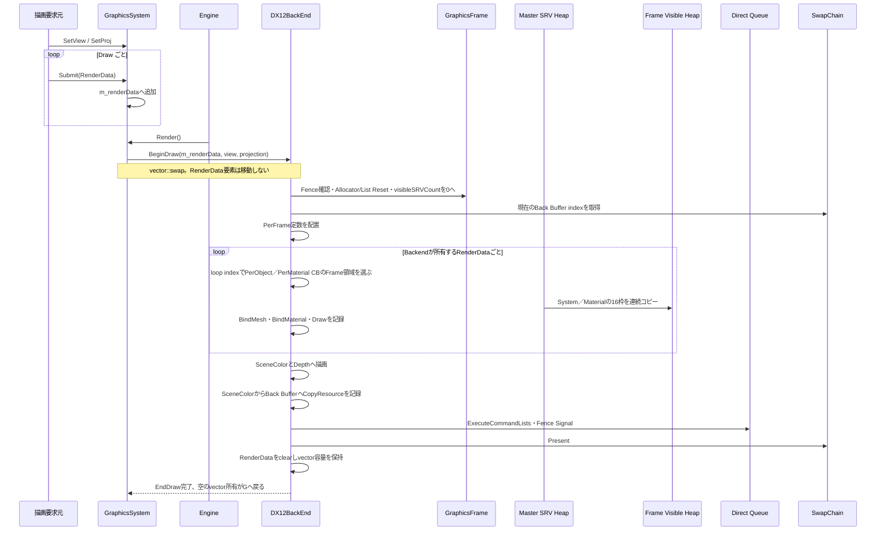

# Graphics 基盤の実行経路
---
描画要求の受付から DX12BackEnd への所有移動、描画・表示、Upload 資源の再利用までを示す。
クラスの役割と API は [GraphicsSystem](./Class/GraphicsSystem.md) に記載する。

## 基本方針
---
Engine が GraphicsSystem を値所有し、GraphicsSystem が DX12BackEnd を値所有する。呼び出し側は GraphicsSystem の static API で View／Projection と Draw ごとの RenderData を設定し、Engine が毎フレーム GraphicsSystem::Render を呼ぶ。static API を呼ぶ具体的な DLL／Facade 境界は未確定。

GraphicsSystem は提出待ち vector を所有する。Render 開始時、DX12BackEnd::BeginDraw がその vector を Backend の空 vector と swap する。RenderData の要素を一つずつコピー／ムーブせず、vector のバッファをそのまま受け渡す。Backend は描画コマンドを記録した後に要素を clear し、容量を保持する。

GPU資源の所有・描画・Upload は DX12BackEnd に集約する。単一 Direct Queue、SceneColor 二枚、Depth、Master／Visible SRV、Frame ごとの PerFrame CB、Backend が持つ PerObject／PerMaterial CB の Frame 別領域、Upload Context の Fence 再利用を扱う。

## 初期化と終了
---

初期化時に固定の Mesh／Texture を描いて見せることは GraphicsSystem の責務にしない。Mesh／Texture を登録し描画要求へ割り当てる API は未確定である。

## フレーム描画と vector の受け渡し
---

System 側の vector は swap 後に空になり、Backend が前回の記録で使った容量を持つ空 vector を受け取る。次回 Submit はその容量を使える。Backend が RenderData を参照するのは CPU のコマンド記録中だけで、GPU は RenderData 自体を参照しない。

Mesh／Texture は RenderData の Key から Backend 所有の GPU資源へ解決する想定。定数は Frame 別 Buffer へコピーし、SRV descriptor は Master から Visible Heap の未使用範囲へ配置する。Mesh／Texture の Key 登録 API と解放・寿命は未確定。

## SceneColor、SRV、固定契約
---
SceneColor は同じ寸法・format・SampleCount の二枚とし、Depth を一つ持つ。書き先と読み元を分け、SceneColor の切り替え時に必要な Barrier と RTV／SRV の対応を更新する。現在の表示経路では SceneColor を COPY_SOURCE、Back Buffer を COPY_DEST として CopyResource を記録し、表示前に Back Buffer を PRESENT へ戻す。

Master SRV は非 Shader-visible の共通 Heap、Visible SRV は Frame ごとの Shader-visible Heap とする。Draw／Pass に使う連続範囲をコピーし、空き texture slot は Null SRV で埋める。同じ Frame の Visible 範囲は Fence 完了まで上書きしない。

| 用途 | 割り当て |
| --- | --- |
| PerFrame／PerObject／PerMaterial | `b0`／`b1`／`b2`、space 0 |
| System Texture | `t0～t15`、space 0 |
| Material Texture | `t0～t15`、space 1 |
| Sampler | Wrap／Clamp × Linear／Point の四種類 |

GraphicsFrame は CommandAllocator／CommandList／PerFrame CB／Visible SRV Heap と、Heap内の次の空き位置を示す visibleSRVCount を持つ。Frame再利用時にFence完了を確認してから値を0へ戻す。PerObject／PerMaterial CB は DX12BackEnd が一つずつ持ち、Frame index ごとの領域へ追記する。RenderData 1件を1 Draw とするため、定数領域のオブジェクト番号は描画ループの index で得て、objectCount は別に保持しない。

初期 Shader はコンパイル済み VS／PS 一組、PSO 一つ、固定 InputLayout とする。PerMaterial は色・Specular・Emission・Roughness・Metallic の固定データ。汎用 Material、Lighting、画像効果は今回の描画契約に追加しない。

World は RenderData から渡す。Transform／Camera クラスは追加せず、View／Projection は GraphicsSystem::SetView／SetProj で渡す。初期のカメラ・Projection の具体値は未確定。

## Upload と Fence 回収
---
Mesh の Vertex／Index Buffer と Texture は Default Heap に置き、Upload Context の Upload Buffer から同じ Direct Queue へコピーする。Context は CommandAllocator／CommandList／Upload Buffer／送信 Fence 値を保持する。

転送→描画の順に同じ Queue へ送る。GPUの転送完了を待つために毎回 CPU を止めず、Upload Buffer と Context は Fence 完了後に回収・再利用する。PerFrame CB、PerObject／PerMaterial の Frame 別領域、Visible Heap は対応する Frame Fence の完了後に再利用する。

## 未確定事項
---
**未確定**：GraphicsSystem の static API を呼ぶ具体的な DLL／Facade 境界、Mesh／Texture の登録・解放 API と Key の型、Material 値を設定する最終 API、単一 vector から二つの PingPong vector へ移行する必要性、Heap／Buffer 容量、Resize、最小化時の Present 同期は未確定。

**提案**：現在は一つの vector と Submit(RenderData) で通常経路を作る。登録 API と呼び出し境界は資源の所有者と寿命を整理してから決める。
